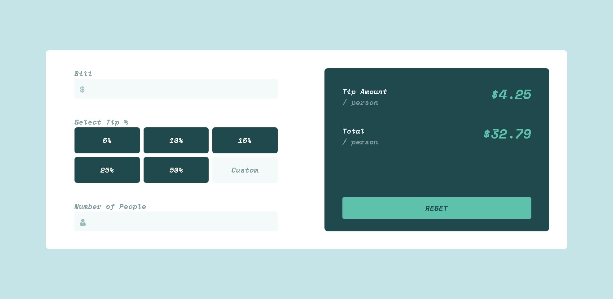
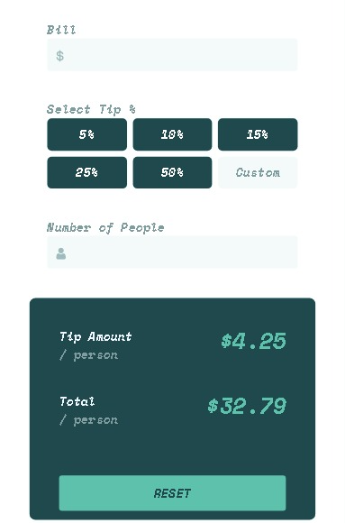

# Frontend Mentor - Tip calculator app solution

This is a solution to the [Tip calculator app challenge on Frontend Mentor](https://www.frontendmentor.io/challenges/tip-calculator-app-ugJNGbJUX). Frontend Mentor challenges help you improve your coding skills by building realistic projects.

## Table of contents

- [Overview](#overview)
  - [The challenge](#the-challenge)
  - [Screenshot](#screenshot)
  - [Links](#links)
- [My process](#my-process)
  - [Built with](#built-with)
  - [What I learned](#what-i-learned)
  - [Continued development](#continued-development)
  - [Useful resources](#useful-resources)
- [Author](#author)
- [site url](#site)

**Note: Delete this note and update the table of contents based on what sections you keep.**

## Overview

### The challenge

Users should be able to:

- View the optimal layout for the app depending on their device's screen size
- See hover states for all interactive elements on the page
- Calculate the correct tip and total cost of the bill per person

### Screenshot

### Links

- Solution URL: [Add solution URL here](https://your-solution-url.com)
- Live Site URL: [Add live site URL here](https://your-live-site-url.com)

## My process

### Built with

- Semantic HTML5 markup
- CSS custom properties
- [Tailwindcss](https://tailwindcss.com/)
- Mobile-first workflow

### What I learned

This was actually my first project with tailwindcss. I got to learn about tailwindcss. it seems more flexible than bootstrap and __i'm loving it__.
and im looking forward to using it in many of my project. 

### Continued development

I'll continue using tailwindcss until it becomes part of me that ill no longer refer to the __docs__ again.

**Note: Delete this note and the content within this section and replace with your own plans for continued development.**

### Useful resources

- [Tailwindcss](https://tailwindcss.com/) - This helped me in my styling.

## Author

- Website - [winnning godspower](https://www.winningtech.com)
- Frontend Mentor - [@winninggodspower](https://www.frontendmentor.io/profile/winninggodspower)

## Site url
> visit site at  [https://winninggodspower.github.io/TIP-CALCULATOR-APP/](https://winninggodspower.github.io/TIP-CALCULATOR-APP/)